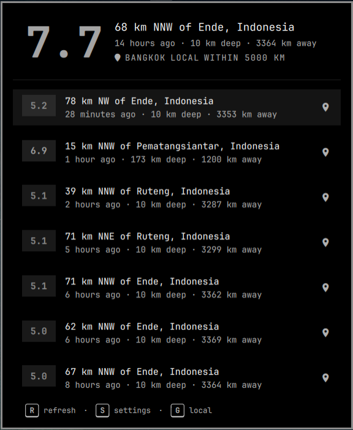

# Omaquake — an Omarchy bar plugin

A top-bar earthquake tracker for [Omarchy](https://omarchy.org), fed by the
[USGS Earthquake Hazards Program](https://earthquake.usgs.gov/).

A pulse glyph sits in the bar with the latest matching magnitude. Click it to
open a themed list of recent events. Set your latitude, longitude, and range
to watch a local radius; events at or above the alert magnitude flash urgent
and can raise a desktop notification.

**No account needed.** With no coordinates configured it finds an approximate
location from your IP address. Press **E** in the panel (or click the location
label) to enter a city, `lat, lon`, and range.



## Install

From this directory, during development:

```bash
ln -sfn "$(pwd)" ~/.config/omarchy/plugins/oma.quake
omarchy-shell shell rescanPlugins
omarchy plugin enable oma.quake
```

From a git remote:

```bash
omarchy plugin add https://github.com/rsoutar/omaquake
omarchy plugin enable oma.quake
```

The widget lands in the right section of the bar by default. Move it with
`omarchy bar move oma.quake --section right`.

## Uninstall

```bash
omarchy plugin disable oma.quake
omarchy plugin remove oma.quake
```

If you installed with a symlink, disable it and remove
`~/.config/omarchy/plugins/oma.quake`.

## Settings

All settings live on the bar layout entry in `~/.config/omarchy/shell.json`.
They can also be edited from Setup → Plugins, or from the panel location editor.

| Setting | Default | Meaning |
|---|---|---|
| `latitude` / `longitude` | empty | Watch origin. Blank uses IP geolocation. |
| `locationName` | empty | Optional label for the origin |
| `rangeKm` | `1000` | Haversine radius in kilometres |
| `minMagnitude` | `2.5` | Hide smaller events |
| `alertMagnitude` | `6.0` | Urgent pill + notification |
| `scope` | `global` | `global` shows everything above `minMagnitude`; `local` keeps events inside the radius |
| `refreshMinutes` | `5` | Poll interval in minutes. Fractions allowed (`0.25` = 15s) for near-realtime local scope; USGS caches responses for 60s so faster polls hit the cache |
| `notify` | `true` | Desktop alerts for new alert-magnitude events |
| `units` | `auto` | `km`, `mi`, or locale auto |

## Panel keys

Hints for **R** / **S** / **G** sit at the bottom of the panel, the same way Flight Radar shows **R** / **S**.

- **R** — refresh now
- **S** — toggle settings (range, magnitude, alerts, units)
- **G** — toggle local / global scope
- **E** — edit location
- **U** — cycle km / mi / auto
- **J / K** or arrows — move the event cursor
- **Enter** — open the selected event on USGS
- **Esc** — close
- Middle-click the pill — refresh
- Right-click the pill — send a status notification

Each card opens the official USGS event page. The map icon opens the
coordinates on OpenStreetMap.

## Data

Events come from the USGS GeoJSON summary feeds and, for a local radius or a
minimum magnitude below 2.5, the
[FDSN Event API](https://earthquake.usgs.gov/fdsnws/event/1/). Feeds are public
and require no key. FDSN polls use the incremental `updatedafter`
parameter, asking only for events updated since the last successful fetch.
USGS caches feed/API responses for 60 seconds, so the next poll is never
scheduled sooner than that (or the `Expires` header), whatever the user's
interval; HTTP 429 rate-limit responses back off via `Retry-After`.

## Development

```bash
node --test tests/model.test.js
```

Saving files under `~/.config/omarchy/plugins/oma.quake/` reloads the plugin.
Force a rescan with `omarchy-shell shell rescanPlugins` if a bad load sticks.

## License

MIT — see [LICENSE](LICENSE).
